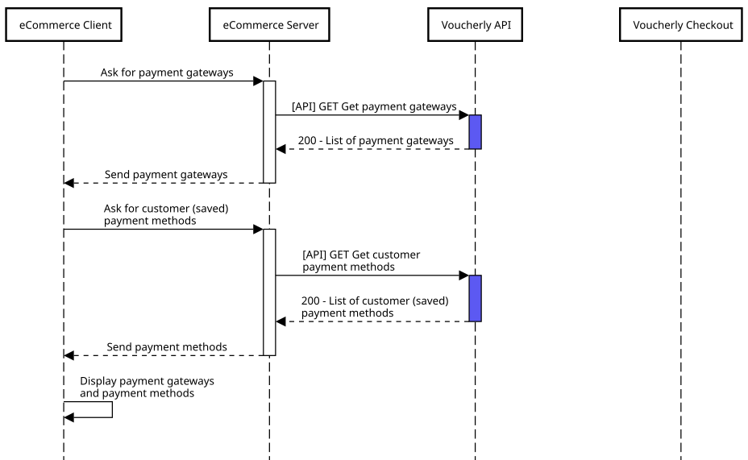

import GatewayFlowContent from './../../_partial/gateway_flow_content.md';

# Custom integration

Show the payment gateways of your account on your own page — each with its own button, instead of a generic *Pay with Voucherly* — and send the customer straight to the one they chose.

:::info Other ways to accept online payments
If you would rather not build the selector, the [hosted checkout](/guides/online-payments/hosted-checkout) offers every gateway on a page hosted by Voucherly, and [Voucherly Components](/guides/online-payments/components) render the whole payment form inside your page. See [Online payments](/guides/online-payments) to compare.
:::

## Quick guide



<GatewayFlowContent />

### 1. Create a Payment for the selected gateway

If clicked, specify the selected Payment gateway using the `selectedPaymentGateway` parameter or the Customer payment method using the `customerPaymentMethodId` parameter.

**Example request**

```json
{
    "mode": "Payment",
    "selectedPaymentGateway": "GATEWAY", // or customerPaymentMethodId
    "customerPaymentMethodId": "my-customer-method-1", // or selectedPaymentGateway
    "customerId": "my-customer-id-1",
    "customerEmail": "mario.rossi@voucherly.it",
    "customerFirstName": "Mario",
    "customerLastName": "Rossi",
    "redirectOkUrl": "https://{{redirect_host}}/payment/success",
    "redirectKoUrl": "https://{{redirect_host}}/payment/error",
    "callbackUrl": "https://{{s2s_host}}/webhook/payment",
    "country": "IT",
    "lines": [
        {
            "quantity": 2,
            "unitAmount": 250,
            "unitDiscountAmount": 10,
            "discountAmount": 0,
            "product": {
                "externalId": "SKU-MUFFIN-001",
                "name": "Muffin al Cioccolato",
                "image": "https://cdn.trovaricetta.com/photo/2016/10/07/1771032/b/muffin-al-cioccolato-facilissimi.jpg",
                "isFood": true
            }
        }
    ],
    "discounts": [
        {
            "discountName": "Coupon",
            "discountDescription": "",
            "amount": 200
        }
    ]
}
```

After creating a Payment, redirect your customer to the `checkoutUrl` returned in the response: Voucherly opens the selected gateway directly, without showing its own selection page.

### 2. Handle the callback and the return

From here on, the flow is the one of the hosted checkout: handle the [S2S callback](/guides/online-payments/hosted-checkout#2-handle-before-redirect-callback-s2s) and [show a success page](/guides/online-payments/hosted-checkout#3-show-a-success-page).

:::tip Saved payment methods
To let a returning customer pay with a saved method in one click, read [Customer management](/api/general/best-practices/customer).
:::
