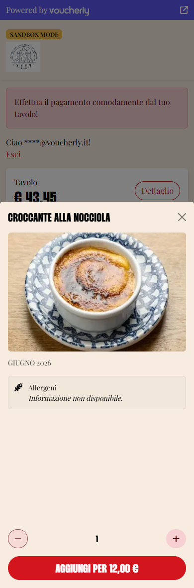
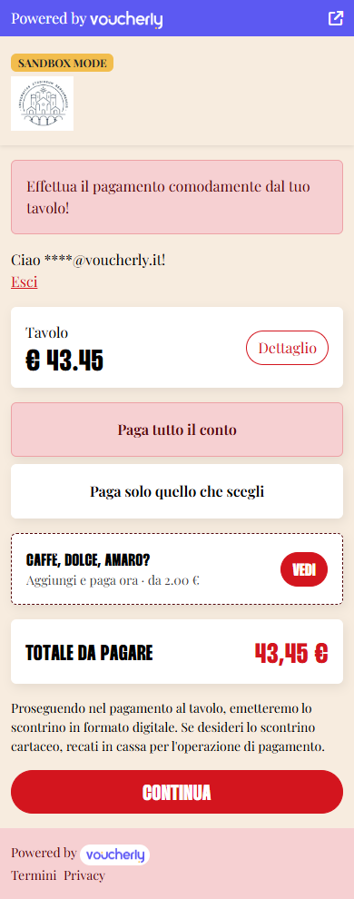
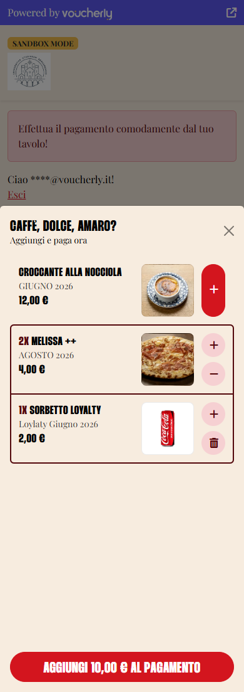
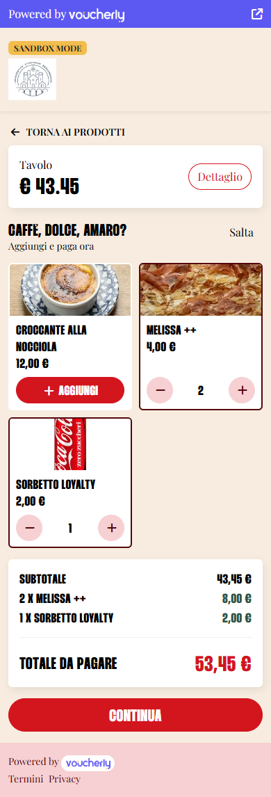

import FAQStructuredData from '@site/src/theme/MDXComponents/FAQStructuredData';

export const faqs = [
  {
    question: 'I added a product to the list but customers never see it. Why?',
    answer: 'The most frequent causes are: the product is not available for that store (check "Prezzo e disponibilità per punto vendita" on the product page), its price is zero, it is a bundle or a choice menu instead of a single product, or it has no till item code while that store runs a POS with a remote catalogue. Only single products with a positive price can be proposed.',
  },
  {
    question: 'Can I cap how many units a customer adds?',
    answer: 'No, and it is deliberate: a cap is friction on a customer who wants to spend more. There is only a technical guard of 99 units per item, which is never shown in the interface.',
  },
  {
    question: 'Do proposed products need a photo?',
    answer: 'Only if you pick a layout that shows images — the carousel, the two-column grid or the single product card. The compact list, which is the default for both placements, works fine without photos and is the safer choice when your catalogue has partial images.',
  },
  {
    question: 'What happens if the customer adds a coffee and then abandons the payment?',
    answer: 'Nothing reaches the bill. A proposed product is written on the table order if and only if a payment that includes it succeeds. An abandoned or declined payment leaves the order exactly as it was.',
  },
  {
    question: 'Does upselling work when customers split the bill?',
    answer: 'It works when they pay the whole bill or select specific products. It is disabled for "split evenly" and custom amount, because those produce an amount-only payment where the added line could not be reconciled with what was collected.',
  },
  {
    question: 'Do the added products appear on the receipt?',
    answer: 'Yes. Added products are payment lines like any other, so they appear on the fiscal receipt and on the non-fiscal receipt, and they are registered on the till together with the rest of the bill.',
  },
];

# Table upselling

## Introduction

Upselling lets you propose a short, curated list of extra products — a coffee, a dessert, an amaro — to customers who are about to pay at the table.
You decide **which products to propose, where to propose them and with which layout**; everything the customer reads (name, description, price, image and allergens) comes straight from your catalogue.

:::info Nothing reaches the bill until it is paid
A table QR code is public: anyone walking past your venue can open it.
For this reason a proposed product is added to the table order **if and only if** a payment that includes it succeeds.
An abandoned payment, a declined card or a closed browser tab leave the order untouched — nobody can load products onto a table without paying for them.
:::

By the end of this guide, you'll know how to:

- Curate the list of products to propose
- Set price and availability per store
- Choose where the proposal appears and which of the six layouts to use
- Recognise why a configured product is not being proposed

## Prerequisites

- Read **[Getting started with a Voucherly account](/guides/intro/getting-started)**.
- Pay at table is already active on at least one store, with rooms and tables configured in **Tavoli > [Sedi e tavoli](https://dashboard.voucherly.it/table/table)**.
- The products you want to propose already exist in your catalogue.
- The till system connected to that store supports adding lines to an open order. If it doesn't, upselling is never proposed there.

## Curate the products to propose

1. Sign in to the Dashboard.
1. Go to **Impostazioni > [Pagamento al tavolo](https://dashboard.voucherly.it/settings/table)** and scroll to the **Upselling** section.
1. Turn on **Proponi prodotti da aggiungere al pagamento**. The rest of the section appears only when this is on.
1. Under **Prodotti proposti**, select **Aggiungi prodotto** and pick a product from your catalogue. Only single products can be proposed: bundles and choice menus are not eligible.
1. Drag the rows by their handle to decide the order in which products are proposed. The first one matters more than the others — it is the one the single product layout shows.
1. Select **Salva**.

Settings and product list are saved together by the same button: until you select it, nothing changes, and the **Modifiche non salvate** badge reminds you of it. Once saved, the new list applies to the very next table, with no cache to wait for.

:::info Texts always come from the catalogue
Name, description, image and allergens are never redefined for the upselling showcase — they are read from the product page every time.
This keeps the product card the customer opens consistent with what they are adding, and means you fix a typo in one place only.
:::

Two warnings can appear above the list, and both are worth acting on:

- **Missing images** — you picked a layout that shows images, but some products have none. Either add the photos or switch to a compact list.
- **Missing till item code** — some products have no item code for the till system. Those products are **not proposed**, because the line could not be written on the bill.

If the list is empty, upselling is not proposed at all, whatever the other settings say.

## Set price and availability per store

Price and availability are read per store, every single time — there is no cache in between, so an "we've run out of tiramisù" applies from the next table onwards.

1. Go to **Inventario > Prodotti** and open the product.
1. In **Prezzo e disponibilità per punto vendita**, fill in the row of the store you want to override.
    - Leave **Prezzo** and **IVA** empty to use the catalogue values.
    - Turn **Disponibile** off to stop proposing that product in that store, without removing it from the upselling list.
1. Save the product.

:::tip One list, many stores
The upselling list is defined once for your whole account, while price and availability are per store.
This is how the same list can propose a €2.00 coffee in one venue, a €2.50 one in another, and nothing at all where the dessert has run out.
:::

## Fill in the allergens

Every proposed product can be opened by the customer, who sees its photo, description and allergen information before adding it.

Compile the information in **Inventario > Prodotti > Allergeni e preferenze alimentari**. The customer sees three different states:

| What you enter | What the customer reads |
| --- | --- |
| Nothing | *Informazione non disponibile* |
| **Nessun allergene** | *Non contiene allergeni* |
| One or more allergens | *Contiene …*, with traces on a separate line |

Dietary preferences (vegan, vegetarian, gluten free, and so on) are shown as badges in the same card.

The quantity stepper inside this card prepares a draft: the total does not move until the customer selects **Aggiungi per …**, so reading the allergens never changes what they are about to pay.

## Choose where to propose the products

There are two independent placements, and you can enable either, both or neither.

**Inline nella pagina di landing** shows the proposal directly on the page the customer lands on after scanning the QR code, right below the payment options and above the total.

**Pagina dedicata** adds one extra step before the payment, with a **Salta** button. It only appears when the customer has **not** already added something from the inline block — it is a last chance, not a second one.

Each placement has its own layout, chosen from the select right below its switch.

## The six layouts

### Inline — Lista compatta

The default. A vertical list of compact rows: name, description and unit price on the left, a square thumbnail on the right when the product has one, and the quantity controls at the end of the row.

Choose it when your catalogue has partial or no images: it is the only inline layout that does not depend on photos.

### Inline — Carosello con foto

A horizontally scrollable strip of tiles, each with a large image on top and the stepper below.

Choose it when every proposed product has a good photo. Products without an image fall back to the initial of their name, which looks out of place next to real photos.

### Inline — Riga singola

A single teaser row showing the title, the subtitle and the lowest price of the list, with a **Vedi** button that opens a panel from the bottom of the screen.

Choose it when the bill has to stay the protagonist: the proposal takes one row and only expands when the customer asks for it.

Inside the panel the same compact rows are used, with the running total on the confirm button.

### Dedicated page — Lista compatta

The default for the dedicated step. The same compact rows, on their own page, with the bill breakdown underneath and a **Salta** button at the top.

### Dedicated page — Griglia a due colonne

A two-column grid of tiles with images.

### Dedicated page — Prodotto singolo

One large card with a full-width image, for a single, binary decision. The product shown is the **first one in your list**, so the ordering you set by dragging the rows is what decides it. If the list has more than one product, the others follow underneath as compact rows.

:::warning Images are not optional in three layouts
The carousel, the two-column grid and the single product card are built around the photo.
If some of your products have none, prefer the compact list — the Dashboard warns you when the combination you chose is at risk.
:::

## Customise title and subtitle

The **Titolo** and **Sottotitolo** fields apply to every layout: changing the format never changes the words the customer reads.

Leave them empty to use the defaults, `Caffè, dolce, amaro?` and `Aggiungi i prodotti e paga ora`.

## When upselling is not proposed

Upselling is proposed only when everything below is satisfied. If something is missing, the block simply does not appear — there is no error message for the customer.

**Because of your configuration**

- **Proponi prodotti da aggiungere al pagamento** is off.
- The product list is empty.
- Both placements are off.
- The store's till system does not support adding lines to an open order.

**Because the customer already added something**

The dedicated page is a last chance, not a second one: it is skipped whenever the customer has already added a product from the inline block. With both placements on, each customer sees the proposal once — either inline or on the dedicated page, never twice.

**Because of the single product**

- It is a bundle or a choice menu instead of a single product.
- It is not active in the catalogue, or **Disponibile** is off for that store.
- Its price is zero.
- It has no till item code, and the store runs a POS with a remote catalogue.

**Because of the payment path the customer chose**

Upselling attaches only to payments that carry product lines, so it is available on **pay the whole bill**, **pay only what you select**, and on a payment made of added products alone.

It is **disabled on "split evenly" and custom amount**: those paths create an amount-only payment, in which the added line would sit on the order without ever being reconciled with what was collected — and the next person to pay would pay for it again. When a customer picks one of those options, the block greys out and explains why:

> Per aggiungere prodotti scegli di pagare tutto il conto o di selezionare i prodotti.

## What the customer pays

Whatever the layout, the total card always breaks the amount down: the bill subtotal, one line per added product with its quantity, and the final amount to pay. It is the one place where the customer verifies what they are paying for.

A few things are decided by Voucherly, not by the customer's device:

- **Price is always read on the server.** The page only sends product identifiers and quantities.
- **Quantity is capped at 99 units per item**, a technical guard that is never displayed.
- **Added products count towards promotions.** When the customer is identified through a loyalty card, the added products are included in the quote sent to the till, so they contribute to order thresholds such as "spend €30 and get…".

## Track upselling on payments

Once a payment succeeds, added products are traceable throughout the Dashboard:

- In the payment detail, added lines carry an **Upselling** badge.
- In the table order, the units carry an **Aggiunta** badge — shown as *Aggiunta n/quantità* when only part of a line's units came in this way, which is what happens when the same product was already on the bill.

Added products are payment lines like any other: they are registered on the till and appear on both the fiscal and the non-fiscal receipt.

## If the till does not register the products

The payment is authorised before the products are written on the bill, so there is a case where the money has been taken but the till refuses the lines.

When that happens the payment is **automatically refunded** and the customer reads:

> Prodotti non aggiunti. Non siamo riusciti ad aggiungere al conto i prodotti che avevi scelto. Tranquillo, ti abbiamo già rimborsato. Riprova, oppure ordinali al personale di sala.

On your side the payment is closed with **Prodotti aggiuntivi non registrati**, reporting how many units across how many products were rejected and by which till system. When some units did make it onto the till before the failure, the message says so explicitly — those are on the bill and have to be settled at the counter.

## Frequently asked questions

<FAQStructuredData faqs={faqs} />

:::info support

- Email support@voucherly.it.
- Submit a support request at [voucherly.it/contattaci](https://voucherly.it/contattaci).
:::
