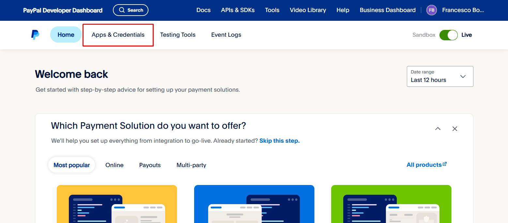
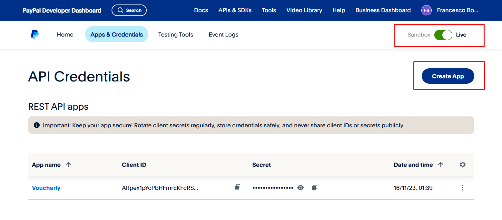

# How to get PayPal client ID and client secret

:::warning
You must use a PayPal business account.
:::

1. Select [Log in to Dashboard](https://developer.paypal.com/dashboard/) and log in or sign up.
1. Select **Apps & Credentials**.

1. Choose your environment (use Sandbox for test payments) and click **Create App** (or use the Default Application).

1. Copy the client ID and client secret for your app.

1. Configure these parameters in **Attività > [Gateway di pagamento](https://dashboard.voucherly.it/merchant/payment-gateways)** on the Voucherly Dashboard. Use the correct environment.

:::tip
- You get different keys for Sandbox and Live. Don’t mix them up.
- Keep your Client Secret private. Never share it publicly.
- If something doesn’t work, double-check the environment and credentials.
:::
