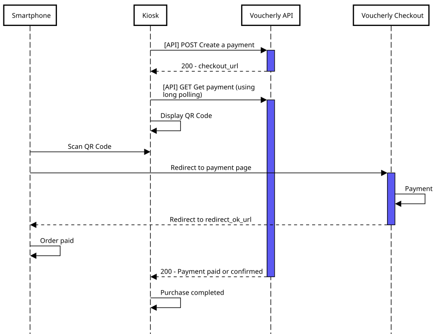

import Tabs from '@theme/Tabs';
import TabItem from '@theme/TabItem';
import Accordion from '@site/src/components/Accordion';
import PrefillCustomerTitle from './../_partial/prefill_customer_title.md';
import PrefillCustomerContent from './../_partial/prefill_customer_content.md';
import GatewayFlowContent from './../_partial/gateway_flow_content.md';
import CreatePaymentContent from './../_partial/create_payment_content.md';

# Kiosk

Use Voucherly's Kiosk integration to process payments directly through self-service kiosks.

:::warning Hardware requirements
The kiosk must have:
- an internet connection
- a display toward the user

If the kiosk is offline but communicates via a local server refer to the [Online Payment use case](./../online-payment?flow=checkout).

:::

:::tip Incoming internet connections

If the kiosk allows incoming internet connections refer to the [Online Payment use case](./../online-payment?flow=checkout).

:::


## Quick Guide

Let’s walk through a simple example of integrating the payment flow for a kiosk.

:::info
This integration is designed to dynamically generate a QR code, enabling users to effortlessly scan it with their mobile devices and complete the payment process seamlessly.
:::

### 1. Display QR Code

You can use Voucherly as an intermediary to manage all your payments or integrate it as an additional payment method alongside your existing ones.

Add a checkout button to your kiosk and create a Payment in Voucherly.



<CreatePaymentContent />

**Example request**

```json
{
    "mode": "Payment",
    "customerEmail": "mario.rossi@voucherly.it",
    "customerFirstName": "Mario",
    "customerLastName": "Rossi",
    "redirectOkUrl": "https://{redirect_host}}/payment/success",
    "redirectKoUrl": "https://{{redirect_host}}/payment/error",
    "country": "IT",
    "lines": [
        {
            "quantity": 2,
            "unitAmount": 250,
            "unitDiscountAmount": 10,
            "discountAmount": 0,
            "productName": "Muffin al Cioccolato",
            "productImage": "https://cdn.trovaricetta.com/photo/2016/10/07/1771032/b/muffin-al-cioccolato-facilissimi.jpg",
            "isFood": true
        }
    ],
    "discounts": [
        {
            "discountName": "Coupon",
            "discountDescription": "",
            "amount": 200
        }
    ]
}
```

After creating the Payment, display the `checkoutUrl` returned in the response as a QR code on the kiosk screen.
Customers can scan the QR code using their mobile devices to access the payment page and complete the transaction.

:::tip
You can use a library like [qrcode.js](https://davidshimjs.github.io/qrcodejs/) or a server-side QR code generator to create and display the QR code.
:::


**Example response**

```json
{
    "id": "my-payment-id-1",
    "tenant": "live",
    "mode": "Payment",
    "customerId": "my-customer-id-1",
    [...]
    "checkoutUrl": "https://example.voucherly.it/checkout",
    "status": "Requested",
    [...]
}
```

## Next steps

<Accordion>
    <PrefillCustomerTitle />
    <PrefillCustomerContent />
</Accordion>

<Accordion>
    <>
        ### Display payment gateways
    </>
    <>
        :::info
        Please refer to [Online payment use case](./../online-payment?flow=gateway) for a complete example.
        :::
        <GatewayFlowContent />
    </>
</Accordion>