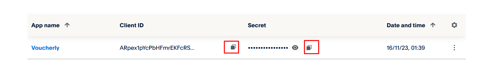

# Come ottenere client ID e client secret di PayPal

:::warning
Devi utilizzare un account PayPal business.
:::

1. Seleziona [Accedi alla Dashboard](https://developer.paypal.com/dashboard/) ed effettua il login o registrati.
1. Seleziona **Apps & Credentials**.

1. Scegli il tuo ambiente (usa Sandbox per i pagamenti di test) e clicca **Create App** (oppure usa la Default Application).

1. Copia il client ID e il client secret della tua app.

1. Configura questi parametri in **Impostazioni > Pagamenti > [Gateway di pagamento](https://dashboard.voucherly.it/settings/payment/payment-gateways)** nella Dashboard di Voucherly. Utilizza l'ambiente corretto.

:::tip

- Ottieni chiavi diverse per Sandbox e Live. Non confonderle.
- Mantieni privato il tuo Client Secret. Non condividerlo mai pubblicamente.
- Se qualcosa non funziona, ricontrolla l'ambiente e le credenziali.

:::

## Abilita Transaction Search per Tesoreria

Tesoreria legge da PayPal i prelievi verso la tua banca, i pagamenti che contengono e la commissione che PayPal ha trattenuto su ciascuno. Usa lo stesso client ID e client secret che hai configurato sopra, ma PayPal lo permette solo quando sull'app è abilitata **Transaction Search**. Fino ad allora, l'account del gateway indica che la credenziale non può leggere gli accrediti.

1. Seleziona [Accedi alla Dashboard](https://developer.paypal.com/dashboard/) ed effettua il login con il tuo account PayPal business.
1. Seleziona **Apps & Credentials** e passa a **Live**.
1. Apri l'app di cui hai salvato client ID e client secret in Voucherly.
1. Nella sezione **Features**, seleziona **Transaction search**.
1. Salva le modifiche.

:::info

- Dopo l'abilitazione PayPal può impiegare fino a 9 ore a concedere l'accesso. Tesoreria riprova da sola più volte al giorno: non devi fare altro.
- Client ID e client secret non cambiano: nella Dashboard di Voucherly non c'è niente da aggiornare.
- I pagamenti continuano a funzionare come prima. Transaction Search permette a Voucherly solo di leggere le tue transazioni, non di muovere denaro.

:::
