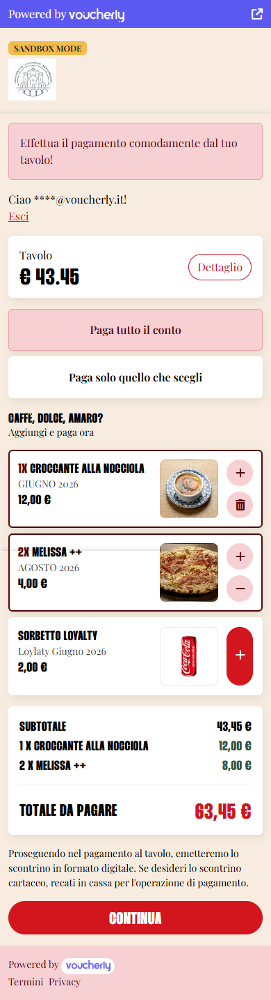
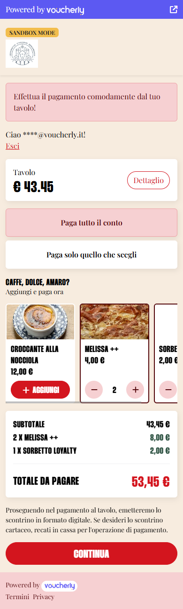
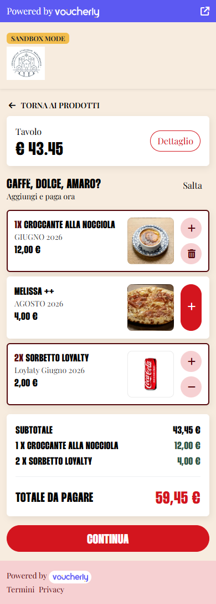
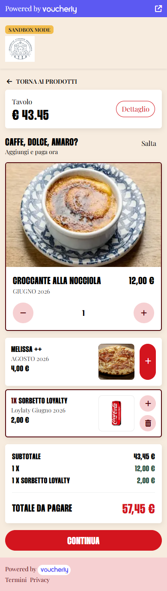

import FAQStructuredData from '@site/src/theme/MDXComponents/FAQStructuredData';

export const faqs = [
  {
    question: 'Ho aggiunto un prodotto all\'elenco ma i clienti non lo vedono. Perché?',
    answer: 'Le cause più frequenti sono: il prodotto non è disponibile per quel punto vendita (controlla "Prezzo e disponibilità per punto vendita" nella scheda del prodotto), il prezzo è a zero, si tratta di un bundle o di un menu a scelta invece che di un prodotto singolo, oppure manca il codice articolo di cassa e quel punto vendita ha un sistema di cassa a catalogo remoto. Solo i prodotti singoli con un prezzo positivo possono essere proposti.',
  },
  {
    question: 'Posso limitare quante unità aggiunge un cliente?',
    answer: 'No, ed è una scelta voluta: un tetto è attrito su un cliente che vuole spendere di più. Esiste solo una guardia tecnica di 99 unità per voce, che non viene mai mostrata nell\'interfaccia.',
  },
  {
    question: 'I prodotti proposti hanno bisogno di una foto?',
    answer: 'Solo se scegli un formato che mostra le immagini: il carosello, la griglia a due colonne o il prodotto singolo. La lista compatta, che è il default di entrambe le posizioni, funziona bene anche senza foto ed è la scelta più sicura se il tuo catalogo ha immagini parziali.',
  },
  {
    question: 'Cosa succede se il cliente aggiunge un caffè e poi abbandona il pagamento?',
    answer: 'Non arriva niente sul conto. Un prodotto proposto viene scritto sull\'ordine del tavolo se e solo se un pagamento che lo comprende va a buon fine. Un pagamento abbandonato o rifiutato lascia l\'ordine esattamente com\'era.',
  },
  {
    question: 'L\'upselling funziona quando i clienti dividono il conto?',
    answer: 'Funziona quando pagano tutto il conto o selezionano prodotti specifici. È disattivato con "dividi alla romana" e con l\'importo libero, perché quei percorsi producono un pagamento a solo importo in cui la riga aggiunta non sarebbe riconciliabile con quanto incassato.',
  },
  {
    question: 'I prodotti aggiunti compaiono nello scontrino?',
    answer: 'Sì. I prodotti aggiunti sono righe di pagamento a tutti gli effetti, quindi compaiono nello scontrino fiscale e nella ricevuta non fiscale, e vengono registrati in cassa insieme al resto del conto.',
  },
];

# Upselling al tavolo

## Introduzione

L'upselling ti permette di proporre un elenco breve e curato di prodotti extra — un caffè, un dolce, un amaro — ai clienti che stanno per pagare al tavolo.
Decidi tu **quali prodotti proporre, dove proporli e con che formato grafico**; tutto ciò che il cliente legge (nome, descrizione, prezzo, immagine e allergeni) arriva direttamente dal tuo catalogo.

:::info Niente entra nel conto finché non è pagato
Il QR code di un tavolo è pubblico: chiunque passi davanti al tuo locale può aprirlo.
Per questo un prodotto proposto viene aggiunto all'ordine del tavolo **se e solo se** un pagamento che lo comprende va a buon fine.
Un pagamento abbandonato, una carta rifiutata o una scheda del browser chiusa lasciano l'ordine intatto: nessuno può caricare prodotti su un tavolo senza pagarli.
:::

Al termine di questa guida saprai:

- Curare l'elenco dei prodotti da proporre
- Impostare prezzo e disponibilità per punto vendita
- Scegliere dove compare la proposta e quale dei sei formati usare
- Riconoscere perché un prodotto configurato non viene proposto

## Prerequisiti

- Leggi **[Come iniziare con un account Voucherly](/guide/introduzione/per-iniziare)**.
- Il pagamento al tavolo è già attivo su almeno un punto vendita, con sale e tavoli configurati in **Tavoli > [Sedi e tavoli](https://dashboard.voucherly.it/table/table)**.
- I prodotti che vuoi proporre esistono già nel tuo catalogo.
- Il sistema di cassa collegato a quel punto vendita supporta l'aggiunta di righe a un conto aperto. Se non lo fa, lì l'upselling non viene mai proposto.

## Cura l'elenco dei prodotti da proporre

1. Accedi alla Dashboard.
1. Vai su **Impostazioni > [Pagamento al tavolo](https://dashboard.voucherly.it/settings/table)** e scorri fino alla sezione **Upselling**.
1. Attiva **Proponi prodotti da aggiungere al pagamento**. Il resto della sezione compare solo quando questa opzione è accesa.
1. Sotto **Prodotti proposti**, seleziona **Aggiungi prodotto** e scegli un prodotto dal catalogo. Puoi proporre solo prodotti singoli: bundle e menu a scelta non sono ammessi.
1. Trascina le righe per la loro maniglia per decidere in che ordine vengono proposti i prodotti. Il primo conta più degli altri: è quello che mostra il formato a prodotto singolo.
1. Seleziona **Salva**.

Impostazioni ed elenco prodotti si salvano insieme con lo stesso pulsante: finché non lo selezioni non cambia nulla, e il badge **Modifiche non salvate** te lo ricorda. Una volta salvato, il nuovo elenco vale già dal tavolo successivo, senza cache da aspettare.

:::info I testi arrivano sempre dal catalogo
Nome, descrizione, immagine e allergeni non sono mai ridefinibili per la vetrina dell'upselling: vengono letti dalla scheda del prodotto ogni volta.
Così la scheda che il cliente apre resta coerente con ciò che sta aggiungendo, e un refuso lo correggi in un punto solo.
:::

Sopra l'elenco possono comparire due avvisi, ed entrambi meritano un intervento:

- **Immagini mancanti** — hai scelto un formato che mostra le immagini, ma alcuni prodotti non ne hanno una. Aggiungi le foto oppure passa a una lista compatta.
- **Codice articolo mancante** — alcuni prodotti non hanno un codice articolo del sistema di cassa. Quei prodotti **non vengono proposti**, perché la riga non sarebbe scrivibile sul conto.

Se l'elenco è vuoto l'upselling non viene proposto affatto, qualunque cosa dicano le altre impostazioni.

## Imposta prezzo e disponibilità per punto vendita

Prezzo e disponibilità vengono letti per punto vendita a ogni richiesta — non c'è nessuna cache di mezzo, quindi un "è finito il tiramisù" vale dal tavolo successivo.

1. Vai su **Inventario > Prodotti** e apri il prodotto.
1. In **Prezzo e disponibilità per punto vendita**, compila la riga del punto vendita che vuoi personalizzare.
    - Lascia **Prezzo** e **IVA** vuoti per usare i valori di listino.
    - Spegni **Disponibile** per smettere di proporre quel prodotto in quel punto vendita, senza toglierlo dall'elenco dell'upselling.
1. Salva il prodotto.

:::tip Un elenco solo, molti punti vendita
L'elenco dell'upselling si definisce una volta per tutto l'account, mentre prezzo e disponibilità sono per punto vendita.
È così che lo stesso elenco propone un caffè a 2,00 € in un locale, a 2,50 € in un altro, e niente del tutto dove il dolce è finito.
:::

## Compila gli allergeni

Ogni prodotto proposto può essere aperto dal cliente, che ne vede foto, descrizione e informazioni sugli allergeni prima di aggiungerlo.

Compila l'informazione in **Inventario > Prodotti > Allergeni e preferenze alimentari**. Il cliente vede tre stati diversi:

| Cosa inserisci | Cosa legge il cliente |
| --- | --- |
| Niente | *Informazione non disponibile* |
| **Nessun allergene** | *Non contiene allergeni* |
| Uno o più allergeni | *Contiene …*, con le tracce su una riga separata |

Le preferenze alimentari (vegano, vegetariano, senza glutine e così via) compaiono come badge nella stessa scheda.

Lo stepper della quantità dentro questa scheda prepara una bozza: il totale non si muove finché il cliente non seleziona **Aggiungi per …**, così leggere gli allergeni non cambia mai quello che sta per pagare.

## Scegli dove proporre i prodotti

Le posizioni sono due e indipendenti: puoi attivarne una, entrambe o nessuna.

**Inline nella pagina di landing** mostra la proposta direttamente sulla pagina su cui il cliente arriva dopo la scansione del QR code, subito sotto le opzioni di pagamento e sopra il totale.

**Pagina dedicata** aggiunge uno step in più prima del pagamento, con un pulsante **Salta**. Compare solo quando il cliente **non** ha già aggiunto qualcosa dal blocco inline: è un'ultima occasione, non una seconda.

Ogni posizione ha il proprio formato, che si sceglie dal menu a tendina sotto il rispettivo interruttore.

## I sei formati

### Inline — Lista compatta

Il default. Una lista verticale di righe compatte: nome, descrizione e prezzo unitario a sinistra, una miniatura quadrata a destra quando il prodotto ne ha una, e i comandi di quantità in fondo alla riga.

Scegli questo formato se il tuo catalogo ha immagini parziali o non ne ha: è l'unico formato inline che non dipende dalle foto.

### Inline — Carosello con foto

Una striscia di tile scorrevole in orizzontale, ognuna con un'immagine grande in alto e lo stepper sotto.

Scegli questo formato se tutti i prodotti proposti hanno una buona foto. I prodotti senza immagine ripiegano sull'iniziale del nome, che accanto a foto vere stona.

### Inline — Riga singola

Una sola riga teaser con titolo, sottotitolo e il prezzo più basso dell'elenco, e un pulsante **Vedi** che apre un pannello dal basso dello schermo.

Scegli questo formato se il conto deve restare il protagonista: la proposta occupa una riga e si espande solo quando è il cliente a chiederlo.

Dentro il pannello vengono usate le stesse righe compatte, con il totale progressivo sul pulsante di conferma.

### Pagina dedicata — Lista compatta

Il default della pagina dedicata. Le stesse righe compatte, su una pagina tutta loro, con la scomposizione del conto sotto e un pulsante **Salta** in alto.

### Pagina dedicata — Griglia a due colonne

Una griglia di tile su due colonne, con le immagini.

### Pagina dedicata — Prodotto singolo

Una sola card grande con l'immagine a tutta larghezza, per una decisione binaria. Il prodotto mostrato è il **primo del tuo elenco**, quindi l'ordine che imposti trascinando le righe è ciò che lo decide. Se l'elenco ha più di un prodotto, gli altri seguono sotto come righe compatte.

:::warning In tre formati le immagini non sono un accessorio
Il carosello, la griglia a due colonne e la card a prodotto singolo sono costruiti attorno alla foto.
Se alcuni dei tuoi prodotti non ne hanno, preferisci la lista compatta: la Dashboard ti avvisa quando la combinazione che hai scelto è a rischio.
:::

## Personalizza titolo e sottotitolo

I campi **Titolo** e **Sottotitolo** valgono per ogni formato: cambiare il formato non cambia mai le parole che il cliente legge.

Lasciali vuoti per usare i default, `Caffè, dolce, amaro?` e `Aggiungi i prodotti e paga ora`.

## Quando l'upselling non viene proposto

L'upselling viene proposto solo se è soddisfatto tutto quello che segue. Se qualcosa manca il blocco semplicemente non compare: per il cliente non c'è nessun messaggio d'errore.

**Per come è configurato**

- **Proponi prodotti da aggiungere al pagamento** è spento.
- L'elenco dei prodotti è vuoto.
- Entrambe le posizioni sono spente.
- Il sistema di cassa del punto vendita non supporta l'aggiunta di righe a un conto aperto.

**Perché il cliente ha già aggiunto qualcosa**

La pagina dedicata è un'ultima occasione, non una seconda: viene saltata ogni volta che il cliente ha già aggiunto un prodotto dal blocco inline. Con entrambe le posizioni attive ogni cliente vede la proposta una volta sola — o inline o nella pagina dedicata, mai due volte.

**Per il singolo prodotto**

- È un bundle o un menu a scelta invece che un prodotto singolo.
- Non è attivo a catalogo, oppure **Disponibile** è spento per quel punto vendita.
- Il prezzo è a zero.
- Non ha il codice articolo di cassa e il punto vendita ha un sistema di cassa a catalogo remoto.

**Per il percorso di pagamento scelto dal cliente**

L'upselling si aggancia solo ai pagamenti che portano righe di prodotto, quindi è disponibile su **paga tutto il conto**, **paga solo quello che scegli** e su un pagamento composto dai soli prodotti aggiunti.

È invece **disattivato con "dividi alla romana" e con l'importo libero**: quei percorsi creano un pagamento a solo importo, in cui la riga aggiunta resterebbe sull'ordine senza mai essere riconciliata con quanto incassato — e il prossimo che paga la pagherebbe di nuovo. Quando il cliente sceglie una di quelle opzioni il blocco si spegne e spiega il perché:

> Per aggiungere prodotti scegli di pagare tutto il conto o di selezionare i prodotti.

## Cosa paga il cliente

Qualunque sia il formato, la card del totale scompone sempre l'importo: il subtotale del conto, una riga per ogni prodotto aggiunto con la sua quantità, e il totale da pagare. È l'unico punto in cui il cliente verifica cosa sta pagando.

Alcune cose le decide Voucherly, non il dispositivo del cliente:

- **Il prezzo viene sempre letto sul server.** La pagina manda solo identificativi dei prodotti e quantità.
- **La quantità è limitata a 99 unità per voce**, una guardia tecnica che non viene mai mostrata.
- **I prodotti aggiunti concorrono alle promozioni.** Quando il cliente è identificato tramite carta fedeltà, i prodotti aggiunti entrano nel preventivo mandato alla cassa, quindi contribuiscono alle soglie d'ordine del tipo "spendi 30 € e…".

## Riconosci l'upselling sui pagamenti

Quando un pagamento va a buon fine, i prodotti aggiunti sono tracciabili in tutta la Dashboard:

- Nel dettaglio del pagamento, le righe aggiunte portano il badge **Upselling**.
- Nell'ordine del tavolo, le unità portano il badge **Aggiunta**, mostrato come *Aggiunta n/quantità* quando solo una parte delle unità di quella riga è entrata così — è ciò che accade se lo stesso prodotto era già sul conto.

I prodotti aggiunti sono righe di pagamento a tutti gli effetti: vengono registrati in cassa e compaiono sia nello scontrino fiscale sia nella ricevuta non fiscale.

## Se la cassa non registra i prodotti

Il pagamento viene autorizzato prima che i prodotti siano scritti sul conto, quindi esiste un caso in cui il denaro è stato incassato ma la cassa rifiuta le righe.

Quando succede, il pagamento viene **rimborsato automaticamente** e il cliente legge:

> Prodotti non aggiunti. Non siamo riusciti ad aggiungere al conto i prodotti che avevi scelto. Tranquillo, ti abbiamo già rimborsato. Riprova, oppure ordinali al personale di sala.

Dalla tua parte il pagamento si chiude con **Prodotti aggiuntivi non registrati**, che riporta quante unità su quante voci sono state rifiutate e da quale sistema di cassa. Quando alcune unità erano comunque finite in cassa prima dell'errore, il messaggio te lo dice esplicitamente: quelle sono sul conto e vanno saldate alla cassa.

## Domande frequenti

<FAQStructuredData faqs={faqs} />

:::info support

- Scrivi a support@voucherly.it.
- Invia una richiesta di supporto su [voucherly.it/contattaci](https://voucherly.it/contattaci).
:::
