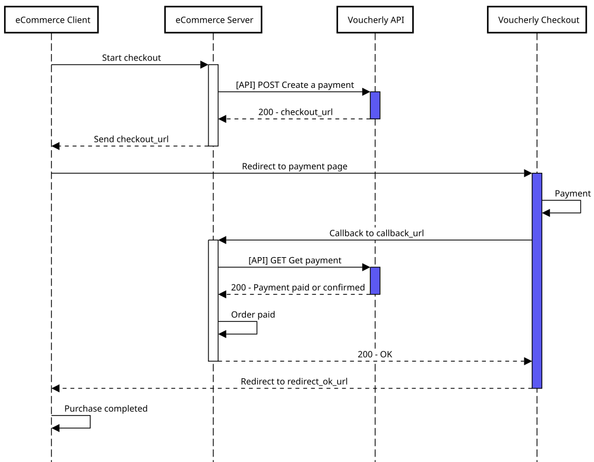

import Tabs from '@theme/Tabs';
import TabItem from '@theme/TabItem';
import Accordion from '@site/src/components/Accordion';
import PrefillCustomerTitle from './../_partial/prefill_customer_title.md';
import PrefillCustomerContent from './../_partial/prefill_customer_content.md';
import GatewayFlowContent from './../_partial/gateway_flow_content.md';
import CreatePaymentContent from './../_partial/create_payment_content.md';
import RedirectUrlContent from './../_partial/redirect_url_content.md';

# Pagamento online

Usa una pagina di checkout predefinita per iniziare ad accettare pagamenti online.

:::info Plugin e-commerce
Voucherly può essere facilmente aggiunto come metodo di pagamento utilizzando uno dei [plugin e-commerce](/guide/integrazioni/plugin-e-commerce).
:::

## Guida rapida

Vediamo un semplice esempio di integrazione del flusso di pagamento da zero.

### 1. Reindirizza il cliente a Voucherly Checkout

<Tabs groupId="flow" queryString>
<TabItem value="checkout" label="Checkout ospitato">

Il modo più semplice e consigliato per integrare Voucherly è utilizzare Voucherly Checkout come un'unica pagina di checkout per tutti i tuoi gateway di pagamento.

Aggiungi un pulsante di checkout al tuo sito che richiami un endpoint lato server per creare un pagamento in Voucherly.

</TabItem>

<TabItem value="gateway" label="Gateway">

Puoi realizzare un'integrazione di pagamento personalizzata mostrando i componenti dei gateway di pagamento sul tuo sito.


<GatewayFlowContent />

</TabItem>
</Tabs>



<CreatePaymentContent />

<Tabs groupId="flow" queryString>
<TabItem value="checkout" label="Checkout ospitato">

**Esempio di richiesta**

```json
{
    "mode": "Payment",
    "customerEmail": "mario.rossi@voucherly.it",
    "customerFirstName": "Mario",
    "customerLastName": "Rossi",
    "redirectOkUrl": "https://{{redirect_host}}/payment/success",
    "redirectKoUrl": "https://{{redirect_host}}/payment/error",
    "callbackUrl": "https://{{s2s_host}}/webhook/payment",
    "country": "IT",
    "lines": [
        {
            "quantity": 2,
            "unitAmount": 250,
            "unitDiscountAmount": 10,
            "discountAmount": 0,
            "product": {
                "externalId": "SKU-MUFFIN-001",
                "name": "Muffin al Cioccolato",
                "image": "https://cdn.trovaricetta.com/photo/2016/10/07/1771032/b/muffin-al-cioccolato-facilissimi.jpg",
                "isFood": true
            }
        }
    ],
    "discounts": [
        {
            "discountName": "Coupon",
            "discountDescription": "",
            "amount": 200
        }
    ]
}
```

</TabItem>

<TabItem value="gateway" label="Gateway">

Al clic, specifica il gateway di pagamento selezionato tramite il parametro `selectedPaymentGateway` oppure il metodo di pagamento del cliente tramite il parametro `customerPaymentMethodId`.

**Esempio di richiesta**

```json
{
    "mode": "Payment",
    "selectedPaymentGateway": "GATEWAY", // oppure customerPaymentMethodId
    "customerPaymentMethodId": "my-customer-method-1", // oppure selectedPaymentGateway
    "customerId": "my-customer-id-1",
    "customerEmail": "mario.rossi@voucherly.it",
    "customerFirstName": "Mario",
    "customerLastName": "Rossi",
    "redirectOkUrl": "https://{{redirect_host}}/payment/success",
    "redirectKoUrl": "https://{{redirect_host}}/payment/error",
    "callbackUrl": "https://{{s2s_host}}/webhook/payment",
    "country": "IT",
    "lines": [
        {
            "quantity": 2,
            "unitAmount": 250,
            "unitDiscountAmount": 10,
            "discountAmount": 0,
            "product": {
                "externalId": "SKU-MUFFIN-001",
                "name": "Muffin al Cioccolato",
                "image": "https://cdn.trovaricetta.com/photo/2016/10/07/1771032/b/muffin-al-cioccolato-facilissimi.jpg",
                "isFood": true
            }
        }
    ],
    "discounts": [
        {
            "discountName": "Coupon",
            "discountDescription": "",
            "amount": 200
        }
    ]
}
```

</TabItem>
</Tabs>

Dopo aver creato un pagamento, reindirizza il cliente al `checkoutUrl` restituito nella risposta.

:::tip QR code

Quando il consumatore effettua un acquisto fisicamente in un negozio Brick & Mortar con uno schermo rivolto verso di lui, puoi mostrare il `checkoutUrl` sotto forma di QR code.

:::

**Esempio di risposta**

```json
{
    "id": "my-payment-id-1",
    "tenant": "live",
    "mode": "Payment",
    "customerId": "my-customer-id-1",
    [...]
    "checkoutUrl": "https://example.voucherly.it/checkout",
    "status": "Requested",
    [...]
}
```

### 2. Gestisci la callback S2S prima del reindirizzamento

Voucherly invia una callback quando un cliente completa con successo un pagamento. Questa callback può essere utilizzata per:

- Inviare al cliente un'email di conferma dell'ordine.
- Registrare la vendita in un database.
- Avviare un flusso di spedizione.

Si consiglia vivamente di rimanere in ascolto di questa callback invece di affidarsi esclusivamente al reindirizzamento del cliente al tuo sito. Attivare le azioni solo dalla pagina di destinazione del Checkout può risultare inaffidabile.

Voucherly invia la callback all'endpoint specificato come `callbackUrl` nella richiesta [Create Payment API](/api/webapi/create-payment).

Scopri di più nella nostra guida [Callback S2S](/api/generale/best-practice/s2s).

:::warning
Assicurati che il tuo endpoint elabori correttamente le callback. In caso contrario, i pagamenti potrebbero essere annullati e rimborsati.
:::

### 3. Mostra una pagina di successo

<RedirectUrlContent />

## Passi successivi

<Accordion>
    <PrefillCustomerTitle />
    <PrefillCustomerContent />
</Accordion>

<Accordion>
    <>
        ### Separare autorizzazione e conferma
    </>
    <>
        :::tip
        Consulta [Come funzionano i pagamenti](/guide/risorse/ciclo-di-vita-dei-pagamenti) per una guida completa sul funzionamento dei pagamenti in Voucherly.
        :::

        Voucherly supporta i pagamenti con carta in due fasi, consentendoti di autorizzare prima una carta e catturare i fondi in un secondo momento. Quando Voucherly autorizza un pagamento, l'emittente della carta garantisce i fondi e blocca l'importo del pagamento sulla carta del cliente. Hai quindi a disposizione un intervallo di tempo specifico per catturare i fondi (a seconda della carta, di solito 5 giorni). Se il pagamento non viene catturato prima della scadenza dell'autorizzazione, il pagamento viene annullato e l'emittente rilascia i fondi bloccati.

        Per abilitare questo processo, imposta il parametro `isAutoConfirm` su `false` durante la creazione del pagamento. Questo indica a Voucherly di autorizzare l'importo sulla carta del cliente senza catturarlo immediatamente.

        :::warning
        Se non viene specificato alcun valore, verrà applicato il comportamento predefinito definito in **Attività > Checkout > Contabilizzazione automatica**.
        :::

        Per confermare un pagamento, puoi utilizzare la Dashboard oppure la [Confirm Payment API](/api/webapi/confirm-payment).

        Se l'ordine non può essere evaso o il cliente annulla prima della spedizione, utilizza la [Refund Payment API](/api/webapi/refund-payment). Voucherly:
        - Annullerà automaticamente le transazioni nello stato `PAID`.
        - Rimborserà le transazioni nello stato `Confirmed`.
    </>
</Accordion>
